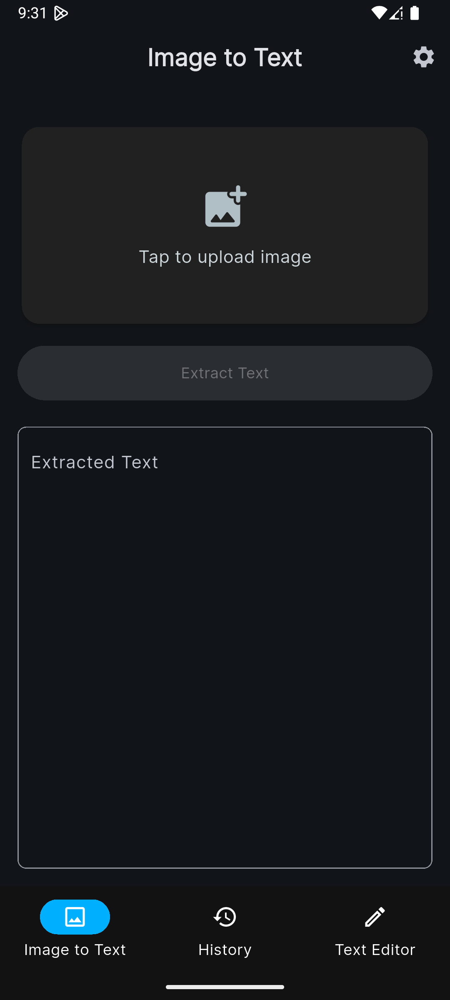
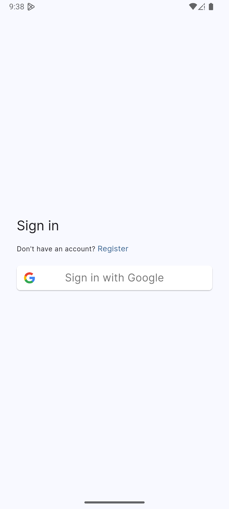

# Text Scanner App

A  Flutter application that scans text from images using advanced Optical Character Recognition (OCR) technology. Effortlessly scan, copy, edit, and share text from photos, documents, receipts, and more—all from your mobile device.

---

## Table of Contents

- [Features](#features)
- [Screenshots](#screenshots)
- [How OCR Works](#how-ocr-works)
- [Getting Started](#getting-started)
- [Installation](#installation)
- [Usage](#usage)
- [Project Structure](#project-structure)
- [Dependencies](#dependencies)
- [Contributing](#contributing)
- [License](#license)

---

## Features

- **Image Capture & Selection:** Take photos with your device camera or pick images from your gallery.
- **Text Extraction (OCR):** Extracts printed or handwritten text from images using Google ML Kit.
- **History:** Automatically saves your scanned text history to the cloud (Firebase).
- **Text Editing:** Edit extracted text, add titles, and format notes.
- **Copy & Paste:** Quickly copy extracted or edited text to your clipboard.
- **Share:** Share text via other apps (email, messaging, etc.).
- **Theme Support:** Light and dark mode with persistent theme settings.
- **User Authentication:** Sign in with Google (Firebase Auth).
- **Cloud Sync:** Sync your notes and history securely with Firebase Firestore.
- **Delete History:** Remove individual or all history items.
- **Responsive UI:** Clean, modern, and intuitive Material 3 design.

---

## Screenshots







---

## How OCR Works

**Optical Character Recognition (OCR)** is a technology that converts images of text—such as scanned documents, photos, or screenshots—into machine-readable and editable text. This app uses [Google ML Kit's Text Recognition](https://developers.google.com/ml-kit/vision/text-recognition) to analyze images and extract text with high accuracy. The process involves:

1. **Image Preprocessing:** The selected or captured image is prepared for analysis.
2. **Text Detection:** The OCR engine detects regions in the image that contain text.
3. **Text Recognition:** Detected regions are processed to recognize and extract the actual characters and words.
4. **Result Display:** The recognized text is displayed in the app, ready for editing, copying, or sharing.

---

## Getting Started

This project is a complete Flutter application demonstrating OCR, cloud sync, and modern UI practices.

### Prerequisites

- [Flutter SDK](https://flutter.dev/docs/get-started/install)
- Android Studio or VS Code
- A device or emulator (Android/iOS)
- Firebase project (for authentication and cloud sync)

---

## Installation

1. **Clone the repository:**
    ```bash
    git clone https://github.com/asathsara/text-scanner-app.git
    cd text_extractor_app
    ```

2. **Install dependencies:**
    ```bash
    flutter pub get
    ```

3. **Configure Firebase:**
    - Download your `google-services.json` (Android) and/or `GoogleService-Info.plist` (iOS) from the Firebase Console.
    - Place them in the appropriate platform folders as per [FlutterFire setup](https://firebase.flutter.dev/docs/overview/).

4. **Run the app:**
    ```bash
    flutter run
    ```

---

## Usage

1. Launch the app on your device or emulator.
2. Sign in with your Google account.
3. Tap the camera or gallery button to select or capture an image.
4. The app will process the image and display the extracted text.
5. Edit, copy, or share the text as needed.
6. View your scan history or edit notes in the Text Editor tab.

---

## Project Structure

```
text_extractor_app/
├── android/
├── ios/
├── lib/
│   ├── components/
│   │   ├── history_item_card.dart
│   │   ├── image_upload_card.dart
│   │   ├── note_action_button.dart
│   │   ├── note_counter_card.dart
│   │   └── stroke_text.dart
│   ├── controllers/
│   │   ├── history_controller.dart
│   │   ├── image_text_controller.dart
│   │   └── text_editor_controller.dart
│   ├── models/
│   │   └── scanned_text.dart
│   ├── providers/
│   │   ├── note_provider.dart
│   │   └── theme_provider.dart
│   ├── screens/
│   │   ├── history_screen.dart
│   │   ├── image_text_screen.dart
│   │   ├── settings_screen.dart
│   │   └── text_editor_screen.dart
│   ├── services/
│   │   ├── clipboard_service.dart
│   │   ├── firebase_service.dart
│   │   ├── share_service.dart
│   │   └── text_recognition_service.dart
│   ├── utils/
│   │   ├── constants/
│   │   │   └── colors.dart
│   │   └── themes/
│   │       ├── button_theme.dart
│   │       ├── navigation_theme.dart
│   │       └── theme.dart
│   ├── firebase_options.dart
│   ├── home_screen.dart
│   └── main.dart
├── pubspec.yaml
├── README.md
└── ...
```

---

## Dependencies

Key packages used:

- [`image_picker`](https://pub.dev/packages/image_picker): Pick images from camera or gallery.
- [`google_ml_kit`](https://pub.dev/packages/google_ml_kit): Perform OCR (text recognition).
- [`firebase_core`](https://pub.dev/packages/firebase_core): Firebase integration.
- [`firebase_auth`](https://pub.dev/packages/firebase_auth): User authentication.
- [`firebase_ui_auth`](https://pub.dev/packages/firebase_ui_auth): Prebuilt Firebase Auth UI.
- [`cloud_firestore`](https://pub.dev/packages/cloud_firestore): Cloud database for notes/history.
- [`provider`](https://pub.dev/packages/provider): State management.
- [`clipboard`](https://pub.dev/packages/clipboard): Copy/paste text.
- [`share_plus`](https://pub.dev/packages/share_plus): Share text with other apps.
- [`package_info_plus`](https://pub.dev/packages/package_info_plus): App version info.
- [`google_fonts`](https://pub.dev/packages/google_fonts): Custom fonts.
- [`intl`](https://pub.dev/packages/intl): Date formatting.
- [`shared_preferences`](https://pub.dev/packages/shared_preferences): Persist theme settings.

See `pubspec.yaml` for the full list.

---


